# yt.pipe — Project Specification

> SCP Foundation 유튜브 콘텐츠 자동 제작 파이프라인
> SCP ID 입력 → 시나리오 → 이미지 → TTS → 자막 → CapCut 프로젝트 자동 조립

- **Module**: `github.com/sushistack/yt.pipe`
- **Go 1.25.7** / Cobra CLI + Chi REST API / SQLite / Docker
- **핵심 철학**: "80% 자동화, 20% 수동 마무리"

---

## 1. 시스템 아키텍처 개요

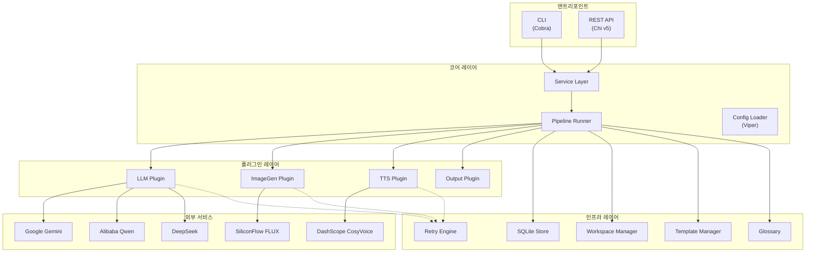

---

## 2. 파이프라인 실행 흐름

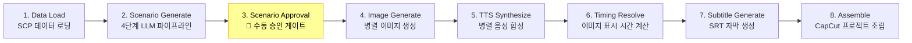

### 2.1 파이프라인 실행 시퀀스 다이어그램

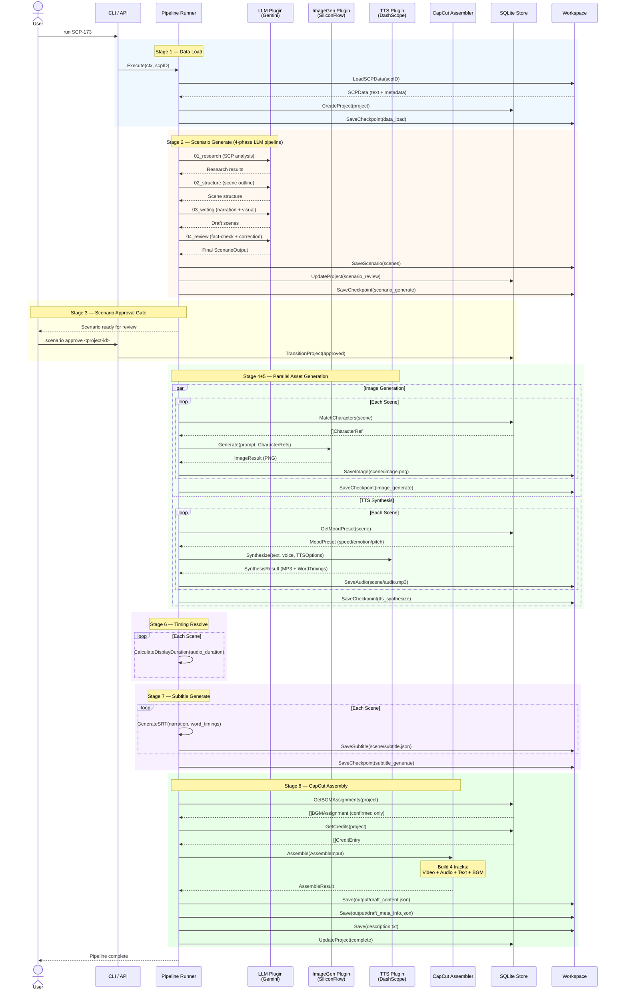

### 2.2 씬별 승인 워크플로우 (Epic 16)

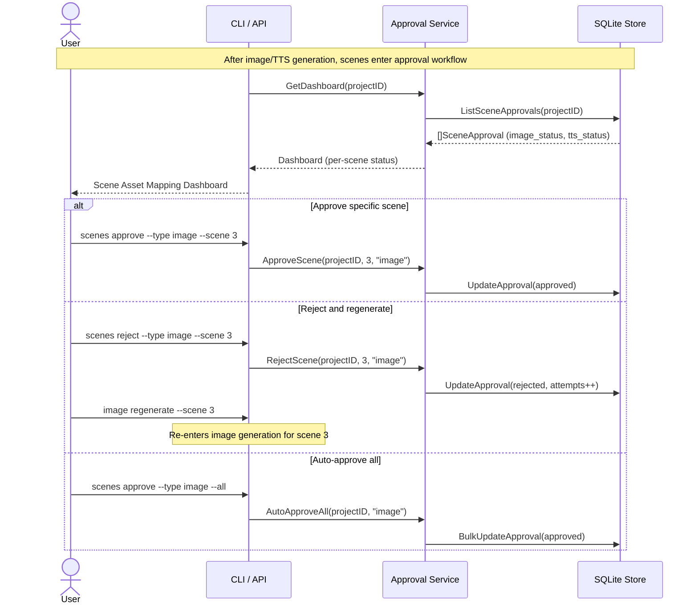

### 2.3 시나리오 생성 4단계 파이프라인

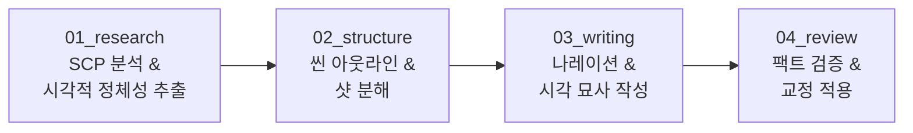

---

## 3. 프로젝트 상태 머신

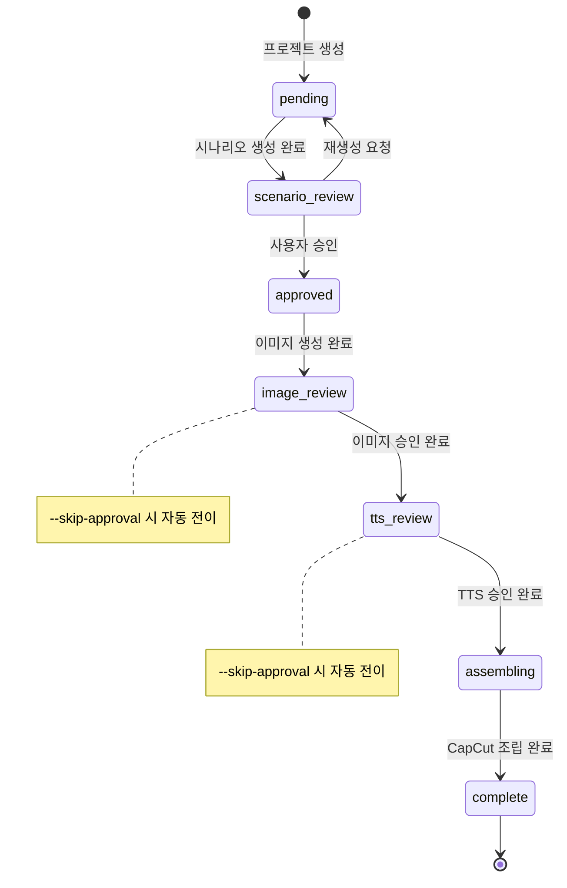

> **Epic 16 변경**: 기존 `approved → generating → complete` 흐름이 `approved → image_review → tts_review → assembling → complete`로 세분화되어 씬별 에셋 승인이 가능합니다. `--skip-approval` 플래그로 기존 자동 흐름도 유지됩니다.

---

## 4. 디렉토리 구조

```
yt.pipe/
├── cmd/yt-pipe/
│   └── main.go                          # 엔트리포인트
├── internal/
│   ├── api/                             # REST API (Chi v5)
│   │   ├── server.go                    #   HTTP 서버 셋업
│   │   ├── auth.go                      #   API 인증 미들웨어
│   │   ├── middleware.go                #   Recovery, Logging, RequestID
│   │   ├── projects.go                  #   프로젝트 CRUD
│   │   ├── pipeline.go                  #   파이프라인 실행/상태
│   │   ├── assets.go                    #   에셋 관리
│   │   ├── config_handler.go            #   설정 엔드포인트
│   │   ├── webhook.go                   #   웹훅 알림
│   │   ├── health.go                    #   헬스체크
│   │   └── response.go                  #   응답 포맷 헬퍼
│   ├── cli/                             # CLI (Cobra)
│   │   ├── root.go                      #   루트 커맨드 & 설정 초기화
│   │   ├── run_cmd.go                   #   전체 파이프라인 실행
│   │   ├── serve_cmd.go                 #   API 서버 시작
│   │   ├── init_cmd.go                  #   대화형 설정 위자드
│   │   ├── stage_cmds.go                #   개별 스테이지 실행
│   │   ├── status_cmd.go                #   프로젝트 상태 조회
│   │   ├── config_cmd.go                #   설정 show/validate
│   │   ├── plugins.go                   #   플러그인 레지스트리 초기화
│   │   ├── assemble_cmd.go              #   수동 조립 커맨드
│   │   ├── clean_cmd.go                 #   워크스페이스 정리
│   │   ├── feedback_cmd.go              #   품질 피드백 제출
│   │   ├── logs_cmd.go                  #   실행 로그 조회
│   │   ├── metrics_cmd.go               #   비용/성능 메트릭
│   │   ├── tts_cmd.go                   #   TTS 전용 커맨드
│   │   ├── template_cmd.go              #   프롬프트 템플릿 CRUD + 오버라이드
│   │   ├── character_cmd.go             #   캐릭터 ID 카드 CRUD
│   │   ├── mood_cmd.go                  #   TTS 무드 프리셋 관리 + 리뷰
│   │   └── bgm_cmd.go                   #   BGM 라이브러리 관리 + 리뷰
│   ├── config/                          # 설정 로딩 (Viper)
│   │   ├── config.go                    #   5단계 우선순위 체인
│   │   └── types.go                     #   설정 구조체
│   ├── domain/                          # 도메인 모델
│   │   ├── project.go                   #   프로젝트 + 상태 머신
│   │   ├── scenario.go                  #   ScenarioOutput, SceneScript
│   │   ├── scene.go                     #   Scene + WordTiming
│   │   ├── job.go                       #   비동기 작업 추적
│   │   ├── manifest.go                  #   증분 빌드 상태
│   │   ├── feedback.go                  #   품질 피드백
│   │   ├── execution_log.go             #   실행 로그
│   │   ├── template.go                  #   프롬프트 템플릿 + 버전 + 오버라이드
│   │   ├── character.go                 #   캐릭터 ID 카드 (시각적 일관성)
│   │   ├── mood_preset.go              #   TTS 무드 프리셋 + 씬 할당
│   │   ├── bgm.go                       #   BGM 라이브러리 + 라이선스 + 씬 할당
│   │   └── errors.go                    #   도메인 에러 타입
│   ├── glossary/                        # SCP 용어 사전
│   │   ├── glossary.go                  #   스레드 안전 용어 조회
│   │   └── doc.go                       #   패키지 문서
│   ├── logging/                         # 구조화 로깅
│   │   └── logging.go                   #   slog 초기화
│   ├── pipeline/                        # 파이프라인 오케스트레이션
│   │   ├── runner.go                    #   메인 파이프라인 실행기
│   │   ├── checkpoint.go                #   체크포인트 & 재개
│   │   ├── dependency.go                #   씬 의존성 그래프
│   │   ├── incremental.go               #   증분 빌드 (해시 기반)
│   │   ├── dryrun.go                    #   설정 검증 (API 호출 없음)
│   │   ├── progress.go                  #   진행률 추적 & 렌더링
│   │   └── reliability.go               #   시그널 핸들링 & 에러 분류
│   ├── plugin/                          # 플러그인 시스템
│   │   ├── registry.go                  #   레지스트리 (Factory 패턴)
│   │   ├── base.go                      #   공통 설정 & 타임아웃 헬퍼
│   │   ├── llm/                         #   LLM 플러그인
│   │   │   ├── interface.go             #     인터페이스 정의
│   │   │   ├── openai.go               #     OpenAI 호환 구현체
│   │   │   ├── fallback.go              #     폴백 체인
│   │   │   └── errors.go               #     LLM 에러
│   │   ├── imagegen/                    #   이미지 생성 플러그인
│   │   │   ├── interface.go             #     인터페이스 정의
│   │   │   ├── siliconflow.go           #     SiliconFlow FLUX 구현체
│   │   │   └── errors.go               #     이미지 에러
│   │   ├── tts/                         #   TTS 플러그인
│   │   │   ├── interface.go             #     인터페이스 정의
│   │   │   ├── dashscope.go             #     DashScope CosyVoice 구현체
│   │   │   └── errors.go               #     TTS 에러
│   │   └── output/                      #   출력 플러그인
│   │       ├── interface.go             #     Assembler 인터페이스
│   │       └── capcut/                  #     CapCut 조립기
│   │           ├── capcut.go            #       프로젝트 조립
│   │           ├── types.go             #       JSON 구조체
│   │           └── validator.go         #       출력 검증
│   ├── retry/                           # 재시도 로직
│   │   └── retry.go                     #   지수 백오프 + 지터
│   ├── service/                         # 비즈니스 서비스 레이어
│   │   ├── project.go                   #   프로젝트 관리
│   │   ├── scenario.go                  #   시나리오 생성 & 승인
│   │   ├── scenario_pipeline.go         #   4단계 시나리오 파이프라인
│   │   ├── image_gen.go                 #   이미지 생성 서비스 (캐릭터 연동)
│   │   ├── image_prompt.go              #   이미지 프롬프트 엔지니어링
│   │   ├── tts.go                       #   TTS 합성 서비스 (무드 프리셋 연동)
│   │   ├── subtitle.go                  #   자막 생성
│   │   ├── timing.go                    #   오디오 타이밍 계산
│   │   ├── assembler.go                 #   출력 조립 코디네이터 (BGM 연동)
│   │   ├── shot_breakdown.go            #   씬→샷 분해
│   │   ├── pronunciation.go             #   발음 오버라이드
│   │   ├── fact_coverage.go             #   SCP 팩트 커버리지
│   │   ├── frozen_descriptor.go         #   Frozen 상태 관리
│   │   ├── execution_summary.go         #   실행 통계
│   │   ├── metrics.go                   #   비용/성능 메트릭
│   │   ├── template.go                  #   프롬프트 템플릿 서비스 (CRUD, 버전, 오버라이드)
│   │   ├── character.go                 #   캐릭터 서비스 (CRUD, 씬 텍스트 매칭)
│   │   ├── mood.go                      #   무드 프리셋 서비스 (LLM 자동 매핑)
│   │   ├── bgm.go                       #   BGM 서비스 (LLM 자동 추천, 크레딧)
│   │   └── default_templates/           #   기본 프롬프트 템플릿 (임베디드)
│   │       ├── scenario.md              #     시나리오 생성
│   │       ├── image.md                 #     이미지 프롬프트
│   │       ├── tts.md                   #     TTS 전처리
│   │       └── caption.md               #     자막 생성
│   ├── store/                           # SQLite 저장소
│   │   ├── store.go                     #   초기화 & 마이그레이션
│   │   ├── project.go                   #   프로젝트 CRUD
│   │   ├── job.go                       #   작업 추적
│   │   ├── manifest.go                  #   매니페스트 CRUD
│   │   ├── feedback.go                  #   피드백 저장
│   │   ├── execution_log.go             #   실행 로그 저장
│   │   ├── template.go                  #   프롬프트 템플릿 CRUD + 버전 관리
│   │   ├── character.go                 #   캐릭터 CRUD + SCP ID 검색
│   │   ├── mood_preset.go              #   무드 프리셋 CRUD + 씬 할당
│   │   ├── bgm.go                       #   BGM CRUD + 태그 검색 + 씬 할당
│   │   └── migrations/                  #   SQL 마이그레이션 (001-006)
│   ├── template/                        # 프롬프트 템플릿 관리
│   │   └── manager.go                   #   로딩 & 렌더링 & 캐시
│   └── workspace/                       # 워크스페이스 관리
│       ├── project.go                   #   디렉토리 초기화 & Atomic I/O
│       └── scp_data.go                  #   SCP 데이터 로딩
├── templates/                           # 프롬프트 템플릿 파일
│   ├── scenario/                        #   시나리오 4단계
│   │   ├── 01_research.md
│   │   ├── 02_structure.md
│   │   ├── 03_writing.md
│   │   └── 04_review.md
│   ├── image/                           #   이미지 프롬프트
│   │   ├── 01_shot_breakdown.md
│   │   └── 02_shot_to_prompt.md
│   └── tts/                             #   TTS 정제
│       └── scenario_refine.md
└── testdata/                            # 테스트 데이터 (SCP-173)
```

---

## 5. 플러그인 시스템

### 5.1 플러그인 아키텍처

```mermaid
classDiagram
    class Registry {
        -factories: map[PluginType]map[string]Factory
        +Register(type, provider, factory)
        +Create(type, provider, config) Plugin
    }

    class PluginConfig {
        +Timeout: 120s
        +MaxRetries: 3
        +BaseDelay: 1s
        +WithTimeout(ctx) context
    }

    class LLM {
        <<interface>>
        +Complete(ctx, messages, opts) CompletionResult
        +GenerateScenario(ctx, scpID, text, facts, meta) ScenarioOutput
        +RegenerateSection(ctx, scenario, sceneNum, instruction) SceneScript
    }

    class ImageGen {
        <<interface>>
        +Generate(ctx, prompt, opts) ImageResult
    }

    class GenerateOptions {
        +CharacterRefs: []CharacterRef
    }

    class CharacterRef {
        +Name: string
        +VisualDescriptor: string
        +ImagePromptBase: string
    }

    class TTS {
        <<interface>>
        +Synthesize(ctx, text, voice, opts) SynthesisResult
        +SynthesizeWithOverrides(ctx, text, voice, overrides, opts) SynthesisResult
    }

    class TTSOptions {
        +MoodPreset: *MoodPreset
    }

    class MoodPreset_TTS {
        +Speed: float64
        +Emotion: string
        +Pitch: float64
        +Params: map
    }

    class Assembler {
        <<interface>>
        +Assemble(ctx, input) AssembleResult
        +Validate(ctx, outputPath) error
    }

    class AssembleInput {
        +BGMAssignments: []BGMAssignment
        +Credits: []CreditEntry
    }

    class BGMAssignment {
        +SceneNum: int
        +FilePath: string
        +VolumeDB: float64
        +FadeInMs: int
        +FadeOutMs: int
        +DuckingDB: float64
    }

    class CreditEntry {
        +Type: string
        +Text: string
    }

    Registry --> LLM
    Registry --> ImageGen
    Registry --> TTS
    Registry --> Assembler

    LLM <|.. OpenAICompatibleProvider
    LLM <|.. FallbackChain
    ImageGen <|.. SiliconFlowProvider
    TTS <|.. DashScopeProvider
    Assembler <|.. CapCutAssembler
```

### 5.2 플러그인 상세 스펙

#### LLM Plugin

| 항목 | 스펙 |
|------|------|
| **인터페이스** | `LLM` |
| **구현체** | `OpenAICompatibleProvider` (Gemini, Qwen, DeepSeek 공용) |
| **프로토콜** | OpenAI Chat Completions API 호환 |
| **폴백** | `FallbackChain` — 순차 시도, 전체 실패 시 에러 |
| **기본 모델** | `gemini-2.0-flash` |
| **Temperature** | `0.7` |
| **Max Tokens** | `4096` |
| **재시도** | 지수 백오프, 429/5xx만 재시도 |
| **파싱** | Markdown 코드 펜스에서 JSON 추출 |

| Provider | Endpoint | 기본 모델 |
|----------|----------|-----------|
| Gemini | `https://generativelanguage.googleapis.com/v1beta/openai` | `gemini-2.0-flash` |
| Qwen | 사용자 설정 | 사용자 설정 |
| DeepSeek | 사용자 설정 | 사용자 설정 |

#### ImageGen Plugin

| 항목 | 스펙 |
|------|------|
| **인터페이스** | `ImageGen` |
| **구현체** | `SiliconFlowProvider` |
| **API** | `/v1/images/generations` |
| **기본 모델** | `black-forest-labs/FLUX.1-schnell` |
| **해상도** | 1920×1080 (16:9) |
| **출력 포맷** | PNG / JPG / WebP |
| **응답 처리** | Base64 + URL 기반 이미지 모두 지원 |
| **Rate Limit** | `Retry-After` 헤더 감지 |
| **캐릭터 참조** | `GenerateOptions.CharacterRefs`로 캐릭터 시각 일관성 유지 |

#### TTS Plugin

| 항목 | 스펙 |
|------|------|
| **인터페이스** | `TTS` |
| **구현체** | `DashScopeProvider` |
| **서비스** | Alibaba DashScope CosyVoice |
| **API** | `/api/v1/services/aigc/text2audio/generation` |
| **기본 모델** | `cosyvoice-v1` |
| **기본 보이스** | `longxiaochun` |
| **출력 포맷** | MP3 |
| **Word Timing** | 밀리초 → 초 변환, 단어별 시작/종료 시간 |
| **보이스 클론** | `cosyvoice-clone-*` 접두어로 지원 |
| **발음 교정** | Glossary 기반 텍스트 치환 후 합성 |
| **무드 프리셋** | `*TTSOptions`로 speed/emotion/pitch 전달 (nil = 기본값) |

#### Output Plugin (CapCut)

| 항목 | 스펙 |
|------|------|
| **인터페이스** | `Assembler` |
| **구현체** | `CapCutAssembler` |
| **출력** | `draft_content.json` + `draft_meta_info.json` |
| **트랙** | Video (이미지), Audio (음성), Text (자막), BGM (배경음악) — 최대 4 병렬 트랙 |
| **캔버스** | 1920×1080, 30 FPS |
| **시간 단위** | 초 → 마이크로초 (×10⁶) |
| **자막 스타일** | 흰색, Bold, 크기 8.0, Y=0.85 위치 |
| **저작권** | CC-BY-SA 3.0 + BGM 크레딧 자동 생성 |
| **BGM 배치** | 씬별 볼륨(dB→linear), 페이드 인/아웃, 더킹 지원 |

---

## 6. 도메인 모델

```mermaid
erDiagram
    PROJECT ||--o{ SCENE : "has many"
    PROJECT ||--o{ JOB : "has many"
    PROJECT ||--o{ SCENE_MANIFEST : "has many"
    PROJECT ||--o{ FEEDBACK : "has many"
    PROJECT ||--o{ EXECUTION_LOG : "has many"
    PROJECT ||--o{ SCENE_MOOD_ASSIGNMENT : "has many"
    PROJECT ||--o{ SCENE_BGM_ASSIGNMENT : "has many"
    PROJECT ||--o{ PROJECT_TEMPLATE_OVERRIDE : "has many"
    SCENE ||--o{ WORD_TIMING : "has many"
    PROMPT_TEMPLATE ||--o{ TEMPLATE_VERSION : "has many"
    PROMPT_TEMPLATE ||--o{ PROJECT_TEMPLATE_OVERRIDE : "overridden by"
    CHARACTER }o--|| SCP_ENTITY : "represents"
    MOOD_PRESET ||--o{ SCENE_MOOD_ASSIGNMENT : "assigned to"
    BGM ||--o{ SCENE_BGM_ASSIGNMENT : "assigned to"

    PROJECT {
        string ID PK
        string SCPID
        string Status "pending|scenario_review|approved|generating|complete|archived"
        int SceneCount
        string WorkspacePath
        time CreatedAt
        time UpdatedAt
    }

    SCENE {
        int SceneNum PK
        string Narration
        string VisualDesc
        string[] FactTags
        string ImagePrompt
        string ImagePath
        string AudioPath
        float AudioDuration
        string SubtitlePath
    }

    SCENE_MANIFEST {
        string ProjectID FK
        int SceneNum
        string ContentHash "SHA-256"
        string ImageHash "SHA-256"
        string AudioHash "SHA-256"
        string SubtitleHash "SHA-256"
        string Status
        time UpdatedAt
    }

    JOB {
        string ID PK
        string ProjectID FK
        string Type "pipeline_run|dry_run|image_generate|tts_generate"
        string Status "running|complete|failed|cancelled"
        float Progress
        string Result
        string Error
    }

    FEEDBACK {
        string ID PK
        string ProjectID FK
        int SceneNum
        string AssetType
        int Rating
        string Comment
    }

    EXECUTION_LOG {
        string ID PK
        string ProjectID FK
        string JobID FK
        string Stage
        string Action
        string Status
        int DurationMs
        float EstimatedCostUSD
        string Details
    }

    WORD_TIMING {
        string Word
        float StartSec
        float EndSec
    }

    SCENARIO_OUTPUT {
        string SCPID
        string Title
        map Metadata
    }

    SCENARIO_OUTPUT ||--o{ SCENE_SCRIPT : "has many"

    SCENE_SCRIPT {
        int SceneNum
        string Narration
        string VisualDescription
        string[] FactTags
        string Mood
    }

    PROMPT_TEMPLATE {
        string ID PK
        string Category "scenario|image|tts|caption"
        string Name
        string Content
        int Version
        bool IsDefault
        time CreatedAt
        time UpdatedAt
    }

    TEMPLATE_VERSION {
        string ID PK
        string TemplateID FK
        int Version
        string Content
        time CreatedAt
    }

    PROJECT_TEMPLATE_OVERRIDE {
        string ProjectID PK
        string TemplateID PK
        string Content
        time CreatedAt
    }

    CHARACTER {
        string ID PK
        string SCPID
        string CanonicalName
        string[] Aliases "JSON"
        string VisualDescriptor
        string StyleGuide
        string ImagePromptBase
        time CreatedAt
        time UpdatedAt
    }

    MOOD_PRESET {
        string ID PK
        string Name "UNIQUE"
        string Description
        float Speed
        string Emotion
        float Pitch
        json ParamsJSON
        time CreatedAt
        time UpdatedAt
    }

    SCENE_MOOD_ASSIGNMENT {
        string ProjectID PK
        int SceneNum PK
        string PresetID FK
        bool AutoMapped
        bool Confirmed
    }

    BGM {
        string ID PK
        string Name
        string FilePath
        string[] MoodTags "JSON"
        int DurationMs
        string LicenseType "royalty_free|cc_by|cc_by_sa|cc_by_nc|custom"
        string LicenseSource
        string CreditText
        time CreatedAt
    }

    SCENE_BGM_ASSIGNMENT {
        string ProjectID PK
        int SceneNum PK
        string BGMID FK
        float VolumeDB
        int FadeInMs
        int FadeOutMs
        float DuckingDB
        bool AutoRecommended
        bool Confirmed
    }
```

---

## 7. 증분 빌드 & 의존성 체인

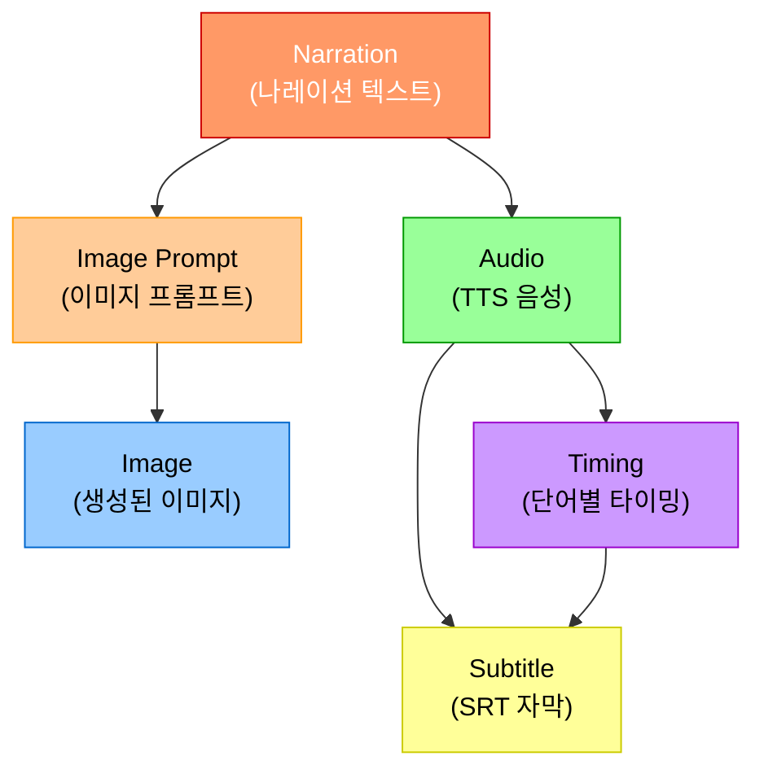

| 에셋 변경 | 무효화되는 다운스트림 |
|-----------|----------------------|
| Narration | Prompt → Image, Audio → Timing → Subtitle |
| Image Prompt | Image |
| Audio | Timing → Subtitle |
| Timing | Subtitle |

**증분 빌드 로직:**
1. SHA-256으로 콘텐츠 해시 계산
2. 매니페스트의 이전 해시와 비교
3. 변경된 씬만 재생성 대상으로 필터링
4. 변경 에셋의 다운스트림 자동 무효화

---

## 8. CLI 명령어

| 명령어 | 설명 | 주요 플래그 |
|--------|------|-------------|
| `yt-pipe init` | 대화형 설정 위자드 | `--force`, `--non-interactive` |
| `yt-pipe run <scp-id>` | 전체 파이프라인 실행 | `--dry-run`, `--resume`, `--auto-approve`, `--force` |
| `yt-pipe serve` | HTTP API 서버 시작 | `--port` |
| `yt-pipe scenario generate <scp-id>` | 시나리오만 생성 | — |
| `yt-pipe scenario approve <project-id>` | 시나리오 승인 | — |
| `yt-pipe image generate <scp-id>` | 이미지 생성 | `--parallel`, `--force` |
| `yt-pipe image regenerate <scp-id>` | 특정 씬 이미지 재생성 | `--scenes 3,5,7`, `--edit-prompt` |
| `yt-pipe tts generate <scp-id>` | TTS 합성 | `--force`, `--scenes` |
| `yt-pipe subtitle generate <scp-id>` | 자막 생성 | — |
| `yt-pipe assemble <project-id>` | 수동 CapCut 조립 | — |
| `yt-pipe status <scp-id>` | 프로젝트 상태 조회 | `--scenes`, `--json-output` |
| `yt-pipe config show` | 설정 표시 (시크릿 마스킹) | — |
| `yt-pipe config validate` | 설정 유효성 검증 | — |
| `yt-pipe clean <scp-id>` | 워크스페이스 정리 | `--all`, `--dry-run`, `--status` |
| `yt-pipe feedback <project-id>` | 품질 피드백 제출 | — |
| `yt-pipe logs <project-id>` | 실행 로그 조회 | — |
| `yt-pipe metrics <project-id>` | 비용/성능 메트릭 | — |

### 프롬프트 템플릿 관리 (Epic 13)

| 명령어 | 설명 | 주요 플래그 |
|--------|------|-------------|
| `yt-pipe template list` | 템플릿 목록 | `--category` |
| `yt-pipe template show <id>` | 템플릿 상세 | `--version` |
| `yt-pipe template create` | 새 템플릿 생성 | `--category`, `--name`, `--file` |
| `yt-pipe template update <id>` | 템플릿 업데이트 (새 버전) | `--file` |
| `yt-pipe template rollback <id>` | 특정 버전으로 롤백 | `--version` |
| `yt-pipe template delete <id>` | 템플릿 삭제 | — |
| `yt-pipe template override <id>` | 프로젝트별 오버라이드 | `--project`, `--file`, `--delete` |

### 캐릭터 ID 카드 (Epic 14)

| 명령어 | 설명 | 주요 플래그 |
|--------|------|-------------|
| `yt-pipe character create` | 캐릭터 생성 | `--scp-id`, `--name`, `--aliases`, `--visual`, `--style`, `--prompt-base` |
| `yt-pipe character list` | 캐릭터 목록 | `--scp-id` |
| `yt-pipe character show <id>` | 캐릭터 상세 | — |
| `yt-pipe character update <id>` | 캐릭터 수정 | `--name`, `--aliases`, `--visual`, `--style`, `--prompt-base` |
| `yt-pipe character delete <id>` | 캐릭터 삭제 | — |

### TTS 무드 프리셋 (Epic 15)

| 명령어 | 설명 | 주요 플래그 |
|--------|------|-------------|
| `yt-pipe mood list` | 무드 프리셋 목록 | — |
| `yt-pipe mood create` | 프리셋 생성 | `--name`, `--emotion`, `--speed`, `--pitch`, `--description` |
| `yt-pipe mood show <id>` | 프리셋 상세 | — |
| `yt-pipe mood update <id>` | 프리셋 수정 | `--name`, `--emotion`, `--speed`, `--pitch` |
| `yt-pipe mood delete <id>` | 프리셋 삭제 | — |
| `yt-pipe mood review <project-id>` | 씬별 무드 할당 리뷰 | `--confirm-all`, `--confirm`, `--reassign --preset` |

### BGM 라이브러리 (Epic 17)

| 명령어 | 설명 | 주요 플래그 |
|--------|------|-------------|
| `yt-pipe bgm add` | BGM 등록 | `--name`, `--file`, `--moods`, `--license-type`, `--credit`, `--source` |
| `yt-pipe bgm list` | BGM 목록 | `--mood` |
| `yt-pipe bgm show <id>` | BGM 상세 | — |
| `yt-pipe bgm update <id>` | BGM 수정 | `--name`, `--moods`, `--license-type`, `--credit` |
| `yt-pipe bgm delete <id>` | BGM 삭제 | — |
| `yt-pipe bgm review <project-id>` | 씬별 BGM 할당 리뷰 | `--confirm-all`, `--confirm`, `--reassign --bgm`, `--adjust --volume --fade-in --fade-out --ducking` |

**글로벌 플래그:** `--config`, `--verbose`, `--json-output`

---

## 9. REST API 엔드포인트

### 9.1 엔드포인트 목록

| Method | Path | 설명 | Auth |
|--------|------|------|------|
| `GET` | `/health` | 헬스 체크 | ✗ |
| `GET` | `/ready` | 레디니스 체크 (DB + Workspace) | ✗ |
| `POST` | `/api/v1/projects` | 프로젝트 생성 | ✓ |
| `GET` | `/api/v1/projects` | 프로젝트 목록 (필터: state, scp_id) | ✓ |
| `GET` | `/api/v1/projects/{id}` | 프로젝트 상세 | ✓ |
| `DELETE` | `/api/v1/projects/{id}` | 프로젝트 삭제 (pending/complete만) | ✓ |
| `POST` | `/api/v1/projects/{id}/run` | 파이프라인 실행 (dryRun 지원) | ✓ |
| `GET` | `/api/v1/projects/{id}/status` | 실시간 파이프라인 상태 | ✓ |
| `POST` | `/api/v1/projects/{id}/cancel` | 파이프라인 취소 | ✓ |
| `POST` | `/api/v1/projects/{id}/approve` | 시나리오 승인 | ✓ |
| `POST` | `/api/v1/projects/{id}/images/generate` | 선택적 이미지 재생성 | ✓ |
| `POST` | `/api/v1/projects/{id}/tts/generate` | 선택적 TTS 재생성 | ✓ |
| `PUT` | `/api/v1/projects/{id}/scenes/{num}/prompt` | 이미지 프롬프트 수정 | ✓ |
| `POST` | `/api/v1/projects/{id}/feedback` | 피드백 제출 | ✓ |
| `GET` | `/api/v1/config` | 설정 조회 (시크릿 마스킹) | ✓ |
| `PATCH` | `/api/v1/config` | 설정 부분 수정 | ✓ |
| `GET` | `/api/v1/plugins` | 플러그인 목록 | ✓ |
| `PUT` | `/api/v1/plugins/{type}/active` | 활성 플러그인 변경 | ✓ |

### 9.2 미들웨어 스택

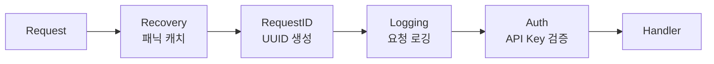

### 9.3 응답 포맷

```json
{
  "success": true,
  "data": { "..." },
  "error": { "code": "NOT_FOUND", "message": "..." },
  "timestamp": "2026-03-09T12:00:00Z",
  "request_id": "uuid-v4"
}
```

| 에러 코드 | HTTP Status | 설명 |
|-----------|-------------|------|
| `NOT_FOUND` | 404 | 리소스 없음 |
| `VALIDATION_ERROR` | 400 | 유효성 검증 실패 |
| `INVALID_REQUEST` | 400 | 잘못된 요청 |
| `CONFLICT` | 409 | 상태 전이 충돌 |
| `INTERNAL_ERROR` | 500 | 서버 내부 에러 |
| `DB_UNAVAILABLE` | 503 | DB 접근 불가 |
| `WORKSPACE_UNAVAILABLE` | 503 | 워크스페이스 접근 불가 |

---

## 10. 설정 시스템

### 10.1 우선순위 체인

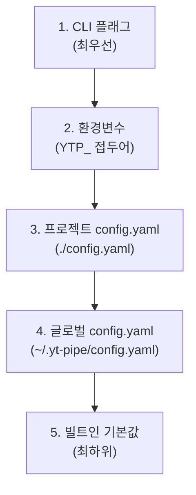

### 10.2 설정 키 상세

| 카테고리 | 키 | 기본값 | 환경변수 |
|----------|-----|--------|----------|
| **경로** | `scp_data_path` | `/data/raw` | `YTP_SCP_DATA_PATH` |
| | `workspace_path` | `/data/projects` | `YTP_WORKSPACE_PATH` |
| | `db_path` | `/data/db/yt-pipe.db` | `YTP_DB_PATH` |
| | `glossary_path` | — | `YTP_GLOSSARY_PATH` |
| | `templates_path` | — | `YTP_TEMPLATES_PATH` |
| **API** | `api.host` | `localhost` | `YTP_API_HOST` |
| | `api.port` | `8080` | `YTP_API_PORT` |
| | `api.auth.enabled` | `false` | `YTP_API_AUTH_ENABLED` |
| | `api.auth.key` | — | `YTP_API_AUTH_KEY` |
| **LLM** | `llm.provider` | `gemini` | `YTP_LLM_PROVIDER` |
| | `llm.endpoint` | Gemini OpenAI URL | `YTP_LLM_ENDPOINT` |
| | `llm.api_key` | — | `YTP_LLM_API_KEY` |
| | `llm.model` | `gemini-2.0-flash` | `YTP_LLM_MODEL` |
| | `llm.temperature` | `0.7` | `YTP_LLM_TEMPERATURE` |
| | `llm.max_tokens` | `4096` | `YTP_LLM_MAX_TOKENS` |
| | `llm.fallback[]` | — | — |
| **ImageGen** | `imagegen.provider` | `siliconflow` | `YTP_IMAGEGEN_PROVIDER` |
| | `imagegen.endpoint` | `https://api.siliconflow.cn/v1` | `YTP_IMAGEGEN_ENDPOINT` |
| | `imagegen.api_key` | — | `YTP_IMAGEGEN_API_KEY` |
| | `imagegen.model` | `FLUX.1-schnell` | `YTP_IMAGEGEN_MODEL` |
| | `imagegen.width` | `1920` | `YTP_IMAGEGEN_WIDTH` |
| | `imagegen.height` | `1080` | `YTP_IMAGEGEN_HEIGHT` |
| **TTS** | `tts.provider` | `dashscope` | `YTP_TTS_PROVIDER` |
| | `tts.endpoint` | `https://dashscope.aliyuncs.com` | `YTP_TTS_ENDPOINT` |
| | `tts.api_key` | — | `YTP_TTS_API_KEY` |
| | `tts.model` | `cosyvoice-v1` | `YTP_TTS_MODEL` |
| | `tts.voice` | `longxiaochun` | `YTP_TTS_VOICE` |
| | `tts.format` | `mp3` | `YTP_TTS_FORMAT` |
| | `tts.speed` | `1.0` | `YTP_TTS_SPEED` |
| **Output** | `output.provider` | `capcut` | `YTP_OUTPUT_PROVIDER` |
| | `output.canvas_width` | `1920` | `YTP_OUTPUT_CANVAS_WIDTH` |
| | `output.canvas_height` | `1080` | `YTP_OUTPUT_CANVAS_HEIGHT` |
| | `output.fps` | `30` | `YTP_OUTPUT_FPS` |
| | `output.default_scene_duration` | `3.0` | `YTP_OUTPUT_DEFAULT_SCENE_DURATION` |
| **시나리오** | `scenario.fact_coverage_threshold` | `80.0` | `YTP_SCENARIO_FACT_COVERAGE_THRESHOLD` |
| | `scenario.target_duration_min` | `10` | `YTP_SCENARIO_TARGET_DURATION_MIN` |
| **로깅** | `log_level` | `info` | `YTP_LOG_LEVEL` |
| | `log_format` | `json` | `YTP_LOG_FORMAT` |
| **웹훅** | `webhooks.urls[]` | — | — |
| | `webhooks.timeout_seconds` | `10` | — |
| | `webhooks.retry_max_attempts` | `3` | — |

---

## 11. 인프라 모듈

### 11.1 SQLite Store

| 항목 | 스펙 |
|------|------|
| **드라이버** | `modernc.org/sqlite` (CGo-free) |
| **모드** | WAL (Write-Ahead Logging) |
| **FK** | Foreign Key 제약 활성화 |
| **마이그레이션** | 임베디드 SQL (001-006), 버전 추적 (`schema_version` 테이블) |
| **테이블** | `projects`, `scene_manifests`, `jobs`, `feedback`, `execution_logs`, `prompt_templates`, `prompt_template_versions`, `project_template_overrides`, `characters`, `mood_presets`, `scene_mood_assignments`, `bgms`, `scene_bgm_assignments` |

### 11.2 Retry Engine

| 항목 | 스펙 |
|------|------|
| **알고리즘** | 지수 백오프 + 지터 (0–25%) |
| **기본 딜레이** | 1초 |
| **최대 딜레이 캡** | 60초 |
| **최대 시도** | 3회 (플러그인 기본) |
| **재시도 대상** | HTTP 429, 5xx, 타임아웃, 네트워크 에러 |
| **즉시 실패** | HTTP 400, 401, 403, 컨텍스트 취소 |
| **인터페이스** | `RetryableError.IsRetryable()` |

### 11.3 Template Manager

| 항목 | 스펙 |
|------|------|
| **엔진** | Go `text/template` |
| **포맷** | `.tmpl` / `.md` 파일 |
| **캐싱** | 파싱된 템플릿 인메모리 캐시 |
| **버전** | SHA-256 해시 (8바이트 잘림) |
| **검증** | 로드 시 문법 검증 (fail-fast) |

### 11.4 Glossary System

| 항목 | 스펙 |
|------|------|
| **포맷** | JSON 파일 |
| **스레드 안전** | `sync.RWMutex` |
| **조회** | 대소문자 무시 |
| **카테고리** | containment_class, organization, entity 등 |
| **통합** | TTS 발음 교정 + 시나리오 용어 참조 |
| **폴백** | 빈 Glossary 허용 (경고 출력 후 계속) |

### 11.5 Workspace Manager

| 항목 | 스펙 |
|------|------|
| **구조** | `{basePath}/{scpID}-{timestamp}/scenes/{sceneNum}/` |
| **Atomic I/O** | Temp 파일 → rename (데이터 손상 방지) |
| **씬 에셋** | `image.{ext}`, `audio.mp3`, `subtitle.json`, `prompt.txt` |
| **메타데이터** | `scenario.json`, `manifest.json`, `progress.json`, `checkpoint.json` |

---

## 12. 체크포인트 & 복구

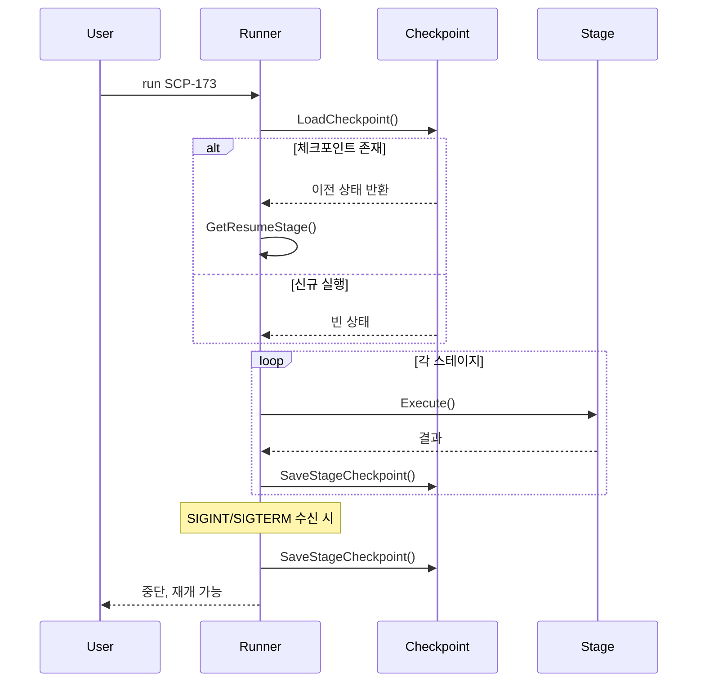

| 기능 | 설명 |
|------|------|
| **스테이지별 저장** | 각 스테이지 완료 후 자동 체크포인트 |
| **시그널 핸들링** | SIGINT/SIGTERM 시 현재 상태 저장 후 종료 |
| **무결성 검증** | 재개 시 파일 일관성 확인 |
| **Force 모드** | `--force`로 체크포인트 초기화 후 처음부터 재실행 |
| **Dry-run** | API 호출 없이 설정/플러그인 유효성 검증 |

---

## 13. 프로젝트 워크스페이스 레이아웃

```
{workspace_path}/
└── SCP-173-20260309-143022/
    ├── scenario.json            # 시나리오 출력
    ├── manifest.json            # 증분 빌드 매니페스트
    ├── progress.json            # 진행률 상태
    ├── checkpoint.json          # 체크포인트 데이터
    ├── description.txt          # 저작권/어트리뷰션
    ├── copyright_warning.json   # 특수 라이선스 경고
    ├── stages/                  # 시나리오 단계별 캐시
    │   ├── 01_research.json
    │   ├── 02_structure.json
    │   ├── 03_writing.json
    │   └── 04_review.json
    ├── scenes/
    │   ├── 1/
    │   │   ├── image.png        # 생성된 이미지
    │   │   ├── image.prev.png   # 백업 (재생성 시)
    │   │   ├── audio.mp3        # TTS 음성
    │   │   ├── audio.bak        # 오디오 백업
    │   │   ├── timing.json      # 단어별 타이밍
    │   │   ├── subtitle.json    # SRT 자막
    │   │   └── prompt.txt       # 이미지 프롬프트
    │   ├── 2/
    │   └── .../
    └── output/
        ├── draft_content.json   # CapCut 프로젝트
        └── draft_meta_info.json # CapCut 메타데이터
```

---

## 14. 외부 의존성

| 패키지 | 버전 | 용도 |
|--------|------|------|
| `github.com/spf13/cobra` | v1.10.2 | CLI 프레임워크 |
| `github.com/spf13/viper` | v1.21.0 | 설정 관리 |
| `github.com/go-chi/chi/v5` | v5.2.5 | HTTP 라우터 |
| `github.com/google/uuid` | v1.6.0 | UUID 생성 |
| `github.com/stretchr/testify` | v1.11.1 | 테스트 어서션 |
| `modernc.org/sqlite` | v1.46.1 | CGo-free SQLite 드라이버 |
| `gopkg.in/yaml.v3` | v3.0.1 | YAML 파싱 |

---

## 15. 빌드 & 배포

| 명령어 | 설명 |
|--------|------|
| `make build` | `bin/yt-pipe` 바이너리 빌드 |
| `make test` | `go test ./...` |
| `make test-integration` | 통합 테스트 (600s 타임아웃) |
| `make lint` | `go vet ./...` |
| `make docker` | Docker 이미지 빌드 |
| `make docker-up` | Docker Compose 시작 |
| `make docker-down` | Docker Compose 중지 |
| `make run` | `go run ./cmd/yt-pipe serve` |
| `make clean` | `bin/` 디렉토리 제거 |

### Docker

| 항목 | 값 |
|------|-----|
| **빌드 스테이지** | Go 1.24 |
| **런타임** | `scratch` (최소 이미지) |
| **사용자** | Non-root (UID 65534) |
| **포트** | 8080 |
| **CA 인증서** | HTTPS 호출용 포함 |

---

## 16. 에러 처리 체계

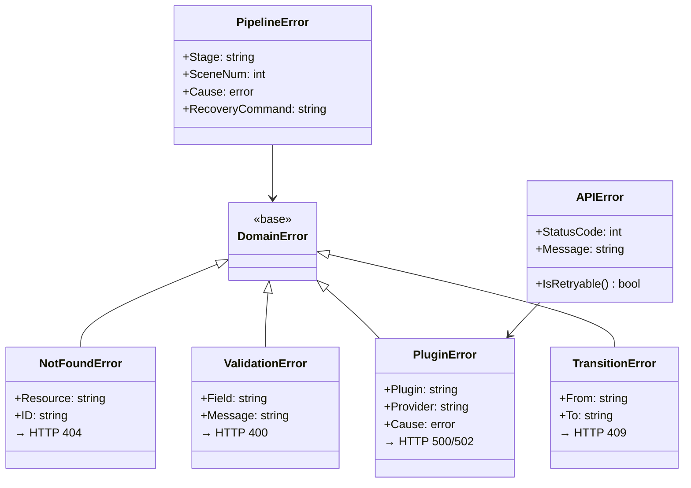

---

## 17. 콘텐츠 커스터마이징 시스템

### 17.1 프롬프트 템플릿 관리 (Epic 13)

4개 카테고리(`scenario`, `image`, `tts`, `caption`)별 프롬프트 템플릿을 DB에서 관리. 최대 10버전 히스토리 + 롤백 + 프로젝트별 오버라이드 지원.

| 기능 | 설명 |
|------|------|
| **카테고리 제약** | DB CHECK 제약으로 유효 카테고리만 허용 |
| **버전 관리** | 업데이트 시 이전 버전 자동 보관, 특정 버전으로 롤백 가능 |
| **프로젝트 오버라이드** | 글로벌 템플릿을 프로젝트 단위로 커스터마이징 |
| **기본 템플릿 자동 설치** | `InstallDefaults()` — 4개 기본 템플릿 임베디드, 멱등 설치 |
| **해상도 체인** | 프로젝트 오버라이드 > 글로벌 템플릿 > 기본 템플릿 |

### 17.2 캐릭터 ID 카드 시스템 (Epic 14)

SCP 엔티티별 시각적 일관성 유지를 위한 캐릭터 카드. 씬 텍스트에서 캐릭터를 자동 매칭하여 이미지 생성 시 참조.

| 기능 | 설명 |
|------|------|
| **별칭 검색** | canonical name + aliases(JSON 배열)로 텍스트 매칭 |
| **SCP ID 필터** | 특정 SCP의 캐릭터만 조회 |
| **이미지 연동** | `MatchCharacters()` → `[]imagegen.CharacterRef` → `GenerateOptions` |
| **일관성 보장** | visual descriptor + style guide + image prompt base로 동일 캐릭터 시각 유지 |

### 17.3 TTS 무드 프리셋 (Epic 15)

씬별 TTS 음성 분위기(속도, 감정, 피치)를 프리셋으로 관리. LLM 분석으로 자동 매핑 후 사용자 확인.

| 기능 | 설명 |
|------|------|
| **프리셋 파라미터** | speed(배속), emotion(감정 키워드), pitch(음높이) |
| **LLM 자동 매핑** | 씬 텍스트 분석 → 무드 이름 추출 → 프리셋 매칭 |
| **2단계 워크플로우** | auto_mapped → confirmed (사용자 확인 후 TTS 적용) |
| **TTS 연동** | 확인된 프리셋 → `TTSOptions.MoodPreset` → `Synthesize()` |

### 17.4 BGM 프리셋 라이브러리 (Epic 17)

무드 태그 기반 BGM 라이브러리. LLM 자동 추천 + 사용자 확인 + CapCut 프로젝트 자동 배치.

| 기능 | 설명 |
|------|------|
| **무드 태그 검색** | JSON LIKE + CASE/SUM 랭킹으로 다중 태그 관련도 정렬 |
| **LLM 자동 추천** | 씬 텍스트 분석 → 무드 태그 추천 → `SearchByMoodTags` → 할당 |
| **2단계 워크플로우** | auto_recommended → confirmed (confirm/reassign/adjust) |
| **CapCut 배치** | 별도 audio 트랙, dB→linear 볼륨 변환, 씬 타임라인 정렬 |
| **라이선스 관리** | 5개 타입(royalty_free, cc_by, cc_by_sa, cc_by_nc, custom) + CHECK 제약 |
| **크레딧 자동 생성** | 확인된 BGM의 credit_text → `CreditEntry` → description.txt |
| **삭제 보호** | 씬 할당이 있는 BGM은 삭제 불가 (FK 무결성) |

### 17.5 LLM 기반 자동 할당 패턴

무드 프리셋과 BGM 추천은 동일한 패턴을 따름:

```
씬 텍스트 → LLM 분석 → 카테고리/태그 추출 → DB 매칭 → 자동 할당(미확인)
→ 사용자 리뷰 (confirm/reassign/adjust) → 확인된 할당 → 파이프라인 적용
```

---

## 18. 전체 데이터 흐름 요약

```mermaid
flowchart TB
    SCP["SCP Wiki Data<br/>(원본 텍스트 + 메타데이터)"]

    subgraph Presets["프리셋 라이브러리"]
        direction LR
        TMPL["프롬프트 템플릿<br/>(scenario/image/tts/caption)"]
        CHAR["캐릭터 ID 카드<br/>(시각적 일관성)"]
        MOOD["무드 프리셋<br/>(speed/emotion/pitch)"]
        BGML["BGM 라이브러리<br/>(mood tags/license)"]
    end

    subgraph Pipeline["파이프라인"]
        direction TB
        S1["1. 연구 분석<br/>LLM: SCP 콘텐츠 분석"]
        S2["2. 구조 설계<br/>LLM: 씬 아웃라인 생성"]
        S3["3. 시나리오 작성<br/>LLM: 나레이션 + 비주얼"]
        S4["4. 검토 & 교정<br/>LLM: 팩트체크"]
        S5["👤 수동 승인 게이트"]
        S6["5. 이미지 생성<br/>SiliconFlow FLUX<br/>+ 캐릭터 참조"]
        S7["6. TTS 합성<br/>DashScope CosyVoice<br/>+ 무드 프리셋"]
        S8["7. 타이밍 & 자막"]
        S9["8. CapCut 조립<br/>+ BGM 배치<br/>+ 크레딧 생성"]
    end

    SCP --> S1 --> S2 --> S3 --> S4 --> S5
    S5 --> S6 & S7
    S6 & S7 --> S8 --> S9

    TMPL -.-> S1 & S3 & S6 & S7
    CHAR -.-> S6
    MOOD -.-> S7
    BGML -.-> S9

    S9 --> OUT["CapCut 프로젝트<br/>draft_content.json<br/>+ 이미지/오디오/BGM/자막 에셋"]

    style S5 fill:#ff9,stroke:#f90,color:#000
    style OUT fill:#9f9,stroke:#090,color:#000
    style Presets fill:#e8f4f8,stroke:#b8d4e3,color:#000
```

---

## 19. 관련 문서

| 문서 | 경로 | 설명 |
|------|------|------|
| **CLI & API 상세 스펙** | `docs/CLI_API_SPEC.md` | 전체 CLI 명령어 + REST API 엔드포인트 + 요청/응답 예시 |
| **PRD** | `_bmad-output/planning-artifacts/prd.md` | 44 FR + 24 NFR |
| **아키텍처** | `_bmad-output/planning-artifacts/architecture.md` | 기술 아키텍처 의사결정 |
| **에픽/스토리** | `_bmad-output/planning-artifacts/epics.md` | 17개 에픽 분해 |
